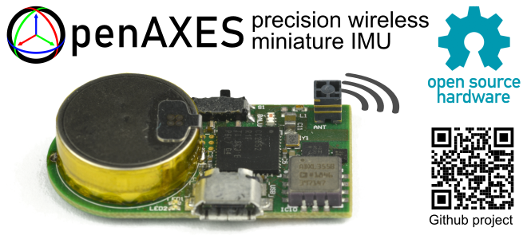

# OpenAXES

**Hardware design files and source code for an open-access wireless IMU.**

The OpenAXES IMU is open-source hardware, which means that you are allowed to modify, share, or sell the design, **if** you adhere to the respecitive licenses (see [LICENSE.txt](/LICENSE.txt) for details).
If you use the OpenAXES project (or parts of it) in scientific work, please see the [Citation](#Citation) section below.

This project is developed at the [Institute of Microelectronic Systems](https://www.ims.uni-hannover.de/) at the Leibniz University Hannover, Germany.

## Hardware

The hardware subdirectory contains the ECAD design files for the OpenAXES PCB and its fabrication outputs, and MCAD files for the housing, the programming adapter, and a calibration fixture.

More information about the hardware and how to fabricate it can be found in [the README in the hardware folder](/hardware/README.md)

## Firmware

The OpenAXES firmware is written in C and based on the CC2652 SDK from Texas Instruments.
It is based on TI-RTOS and can be compiled with [Code Composer Studio (CCS)](https://www.ti.com/tool/CCSTUDIO).

More information on how to compile and flash the firmware can be found in [the README in the firmware folder](/firmware/README.md)

## Citation

If you use the OpenAXES project (or parts of it) in scientific work,
please cite our upcoming paper (**submitted for peer review - not published yet**).

> Title: "OpenAXES: An Open-Source Wireless Inertial Measurement Unit"
>
> Authors: Fritz Webering, Nils Stanislawski, Joseph Winkler, Sarah Kleinjohann, Holger Blume
>
> Journal: [IEEE Sensors Letters](https://ieee-sensors.org/ieee-sensors-letters/)

The correct precise citation will be updated as soon as possible.

## Developers

- Fritz Webering (webering@ims.uni-hannover.de)
- Nils Stanislawski (stanislawski@ims.uni-hannover.de)
