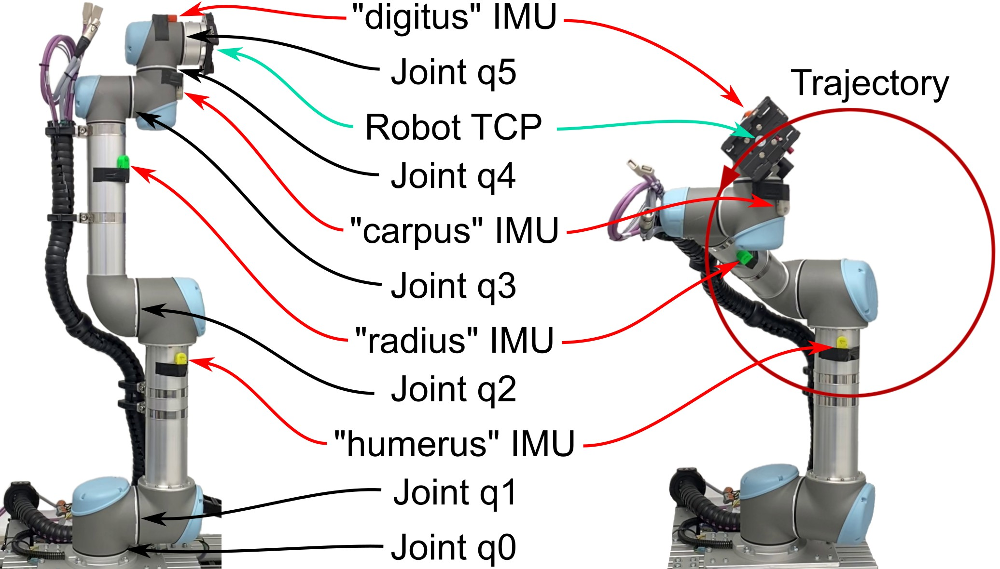

# OpenAXES Example Robot Dataset

**Since git repositories are not suitable for storing large amounts of static data, the dataset itself is kept in the research data repository of the LUH: https://doi.org/10.25835/psqqs9w0. This repository just contains the Jupyter Notebook for quick access.**

This dataset was recorded using four OpenAXES IMUs mounted on the segments of a robot arm (UR5 by Universal Robots), as shown in Fig. 4.
The robot arm was programmed to perform a calibration movement, then trace a 2D circle or triangle in the air with its tool center point (TCP), and return to its starting position, at four different speeds from 100 mm/s to 250 mm/s.
This results in a total of 8 different scenarios (2 shapes times 4 speeds).
The ground truth joint angle and TCP position values were obtained from the robot controller.
The calibration movement at the beginning of the measurement allows for calculating the exact orientation of the sensors on the robot arm.

<br>
*Fig. 4  Setup of the robot arm experiment, showing the four IMUs, the six joints of the robot arm, the tool center position (TCP) and the circle trajectory.*

The IMUs were configured to send the raw data from the three gyroscope axes and the six accelerometer axes to a PC via BLE with 16 bit resolution per axis and 100 Hz sample rate.
Since no data packets were lost during this process, this dataset allows comparing and tuning different sensor fusion algorithms on the recorded raw data while using the ground truth robot data as a reference.

In order to visualize the results, the quaternion sequences from the IMUs were applied to the individual segments of a 3D model of the robot arm.
The end of this kinematic chain represents the TCP of the virtual model, which should ideally move along the same trajectory as the ground truth, barring the accuracy of the IMUs.
Since the raw sensor data of these measurements is available, the calibration coefficients can also be applied ex-post.

Since there are are 6 joints but only 4 IMUS, some redundancy must be exploited.
The redundancy comes from the fact that each IMU has 3 rotational degrees of fredom, but each joint has only one:
* The data for `q0` and `q1` are both derived from the orientation of the "humerus" IMU.
* `q2` is the difference<sup>†</sup> between the orientation of the "humerus" and "radius" IMUs.
* `q3` is the difference between the orientation of the "radius" and "carpus" IMUs.
* `q4` is the difference between the orientation of the "carpus" and "digitus" IMUs.
* The joint `q5` does not influence the position of the TCP, only its orientation, so it is ignored in the evaluation.
* <sup>†</sup> *Of course, difference here means not the subtraction of the quaternions but the rotational difference, which is the `R1 * inv(R0)` for two quaternions (or rotations) `R0` and `R1`. The actual code works a bit differently, but this describes the general principle.*

## Data

* Data recorded from the IMUs is in the directory `measure_raw-2022-09-15/`, one folder per scenario.
In those folders, there is one CSV file per IMU.
* Data recorded from the robot arm is in the directory `measure_raw-2022-09-15/robot/`, one CSV and MAT file per scenario.
* Some photos and videos of the recording process can be found in `Media`. Videos are stored in [git lfs](https://git-lfs.com/).

## Evaluation

The file `openaxes-example-robot-dataset.ipynb` is provided to play around with the data in the dataset and demonstrate how the files are read and interpreted.
To use the notebook, set up a Python 3 virtual environment and therein install the necessary packets with `pip install -r resuirements.txt`.
In order to view the graphs contained in the ipynb file, you will most likely have to trust the notebook beforehand, using the following command:

```bash
jupyter trust openaxes-example-robot-dataset.ipynb
```

**Beware:** This notebook is not a comprehensive evaluation and any results and plots shown in the file are not necessarily scientifically sound evidence of anything.

The notebook will store intermediate files in the `measure_raw-2022-09-15` directory, like the quaternion files calculated by the different filters, or the files containing the reconstructed TCP positions.
All intermediate files should be ignored by the file `measure_raw-2022-09-15/.gitignore`.

The generated intermediate files are also provided in the file `measure_raw-2022-09-15.tar.bz2`, in case you want to inspect the generated files without running the the notebook.

## Tools

A number of tools are used in the evaluation notebook.
Below is a short overview, but not a complete specification.
If you need to understand the input and output formats for each tool, please read the code.

* The file `calculate-quaternions.py` is used in the evaluation notebook to compute different attitude estimation filters like Madgwick or VQF on the raw accelerometer and gyroscrope measurements at 100 Hz.
* The directory `madgwick-filter` contains a small C program that applies the original Madgwick filter to a CSV file containing raw measurements and prints the results. It is used by `calculate-quaternions.py`.
* The file `calculate-robot-quaternions.py` calculates a CSV file of quaternions equivalent to the IMU quaternions from a CSV file containing the joint angles of the robot.
* The program `dsense_vis` mentioned in the notebook is used to calculate the 3D model of the robot arm from quaternions and determine the mounting orientations of the IMUs on the robot arm.
  This program will be released at a future date.
  In the meantime, the output files of `dsense_vis` are provided in the file `measure_raw-2022-09-15.tar.bz2`, which contains the complete content of the `measure_raw-2022-09-15` directory after executing the whole notebook.
  Just unpack this archive and merge its contents with the `measure_raw-2022-09-15` directory.
  This allows you to explore the reconstructed TCP files for the filters implemented at the time of publication.
