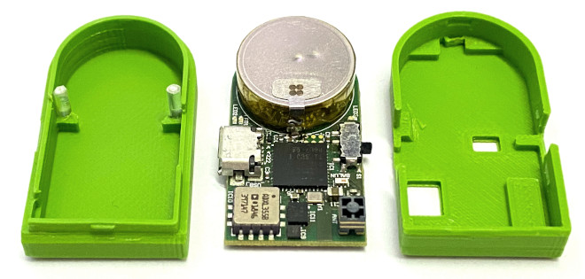
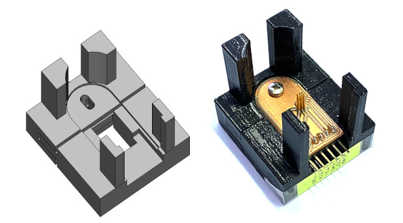

# Hardware

The **Hardware** subdirectory contains the ECAD design files for the OpenAXES PCB and its fabrication outputs, and MCAD files for the housing and calibration fixture.

## PCB

This directory comprises the Altium Designer and KiCad EDA files. 
Altium Designer is a globally renowned PCB and electronic design software. 
KiCad, on the other hand, is a free open source software suite for EDA. 
The use of these two platforms ensures our project is accessible to a broad range of users.

The OpenAXES hardware platform was originally developed using Altium Designer.
To allow for the use of open source EDA software tools it has been ported to KiCad.
Known differences in the design files are only found in the silkscreen layers, so that there are no restrictions on the underlying functionality of the PCB.

### Getting Started

To work with the files contained in this directory, you will need to have the appropriate software installed on your local machine.

- For Altium files, download and install [Altium Designer](https://www.altium.com/)
- For KiCad files, download and install [KiCad EDA](https://www.kicad.org/)

Once you have installed the appropriate software, clone the repository and navigate to the respective subdirectories to access the project files.

### Fabrication outpus

Fabrication outputs are provided in the _PCB/Altium/Project Outputs for OpenAXES_ subdirectory.
Output files for both single PCB and a panel optimized for mass production are included.
 
### Deprecated components

- **BMI160**; pin-compatible replacement: BMI270

## Housing

The housing for the OpenAXES IMU can be found in the **hardware/case** subdirectory.
It was designed in FreeCAD 0.20 for 3D-printing with a 0.4 mm diameter FDM nozzle.
If the 3D printer is tunes correctly, the two halves of the case will snap together and provide a tight fit for the PCB.

There are cutouts for the USB port, the power switch, the analog pads on the bottom of the PCB, and for the JTAG adapter.
The two holes at the top can be plugged with short pieces of transparent 3D-printing filament (1.75 mm diameter).
These will act as light guides for the top LEDs next to the battery.

## Programming adapter

The programming adapter found in the **hardware/programming-adapter** directory comprises a 3D-printable fixture and a single-layer PCB with spring loaded pins.
These work together with the case, holding the IMU in place and contacting the six pads on the underside of the IMU PCB, for JTAG programming or debugging.

## Calibration fixture

The calibration fixture found in **hardware/calibrator** is an icosahedron (20-sided polyhedron) with a recess that accepts the IMU case.
This fixture can be used together the with scripts in the **calibration** directory to obtain the sensor calibration coefficients for each individual unit.

