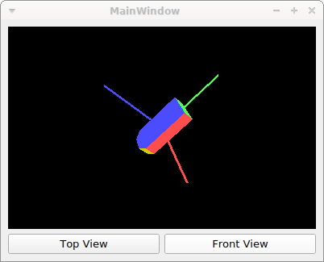

# IMU Quaternion Visualization

The folder `/tools/visualization/UDP_Quaternion_OpenGL_Visualisation` contains a Qt project to visualize the Quaternions received from an OpenAXES IMU.

It receives Quaternions via UDP from the `imu_control.py` script, which will send out one UDP packet to localhost for every received BLE notification.
By default, UDP port 1024 wille, but that can be changed by changing the line `#define UDP_PORT 1024` in `mainwindow.cpp`, and with the second positional command line argument for the script (see `imu_control.py --help`).

From each incoming UDP packet, the four signed 16-bit integers that represent the quaternion will be extracted.
The resulting quaternions will be visualized using a 3D-model of the IMU in OpenGL.